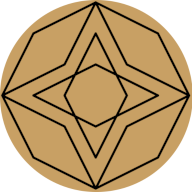

<!--  -->

<!--  -->
 
 

<!--  -->

# GeoDoodle

###### "Geometry Doodle"

This project is hosted at [https://smartycope.org/geodoodle](https://smartycope.org/geodoodle).

## Table of Contents

- [About](#about)
- [Running](#running)
- [Documentation](#documentation)
- [Contributing](#contributing)
- [History](#history)

## About

This project is an attempt to recreate the experience of doodling on graph paper. Unlike a traditional drawing program, you can't draw whatever lines you want, it's intentionally constrainted to only allow drawing lines between the intersections of the graph paper.

## Running

- To install dependancies and setup locally: `npm install`.
- To run normally: `npm start`.
- To run in development mode: `npm run dev`.
- To build: `npm run build`.
- To deploy: `npm run deploy`.
- To run tests: `npm test`.
- To lint: `npm run lint`.
- To format: `npm run pretty` (runs both eslint and prettier).
- To run storybook: `npm run storybook`.

## Documentation

For developer documentation, see the [dev_docs folder](dev_docs).

## Contributing

I love people helping me with this project! GeoDoodle has been my hobby project for a long time, and I love sharing it with people. There's basically no standards, it's pretty casual. Just try to use standard git practices, and if you're unclear on what those are, I can help you out.

To start, check out the [dev_docs folder](dev_docs) for some explanations, definitions, and relevant files in the project.

There's also a "good first issue" label on issues that are easy to get started with.

## History

I've always liked doodling on graph paper. I like making interesting patterns by drawing lines between the intersections. This is basically automated graph paper.

This is the 6th ish iteration of this project. It was my first real programming project, and every time I learn more I end up getting excited and rewriting the project using my new knowledge. As such, JavaScript is the 3rd language it's been written in, you can see the other [unworking] versions in my [other repo](https://github.com/smartycope/GeoDoodle).

Honestly, this is mostly for my own enjoyment. I've tried to fine-tune it and make it as detailed as possible, so feel free to play with it and have fun. But really this is just a hobby project, so if you're looking for actually _useful_ software, this probably isn't what you're looking for.

That being said, there are potential applications for it, especially with minor adjustments. For instance, creating quilting patterns (something I eventually intend to get to), planning out floor or yard layouts, or creating dynamic screensavers.

To see more about this project, see my blog post about it [here](https://smartycope.org/posts/GeoDoodle/)

<!--
## Current branch todos:
Things I need to remember to do before merging the current branch. Don't merge this list!
- reminging the only bound via double tap adds it back after a sec

## Other todos that should be issues but I'm lazy:
- mirror rotate icons on paper should scale with current scale
- Add to the Concepts help page
- Add explanatuon text as a controlled snackbox or tooltip that disapears on next touch On mobile
- mobile toolbar stil lshows taps
- import BorderClearIcon from '@mui/icons-material/BorderClear'; -- this might be good somewhere
- if the clipboard buttons would go off the side of the screen, they should adjust to stay on screen
- clipboard doesn't mirror around mirror origins
- move all the stuff in options that relate to color into the theme
-->
